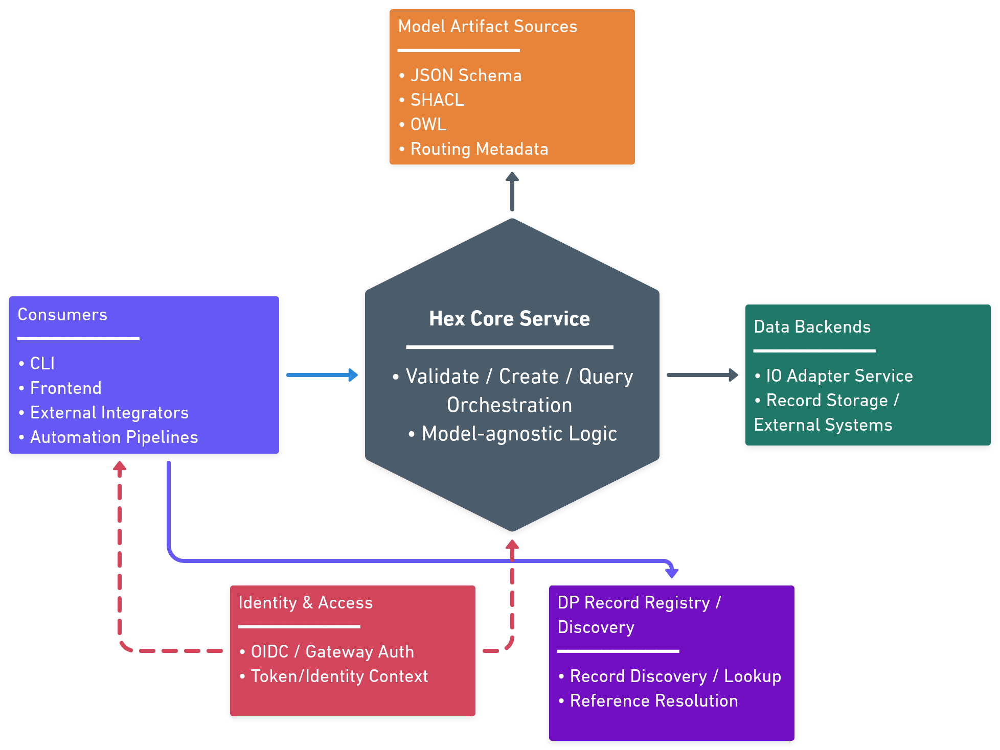
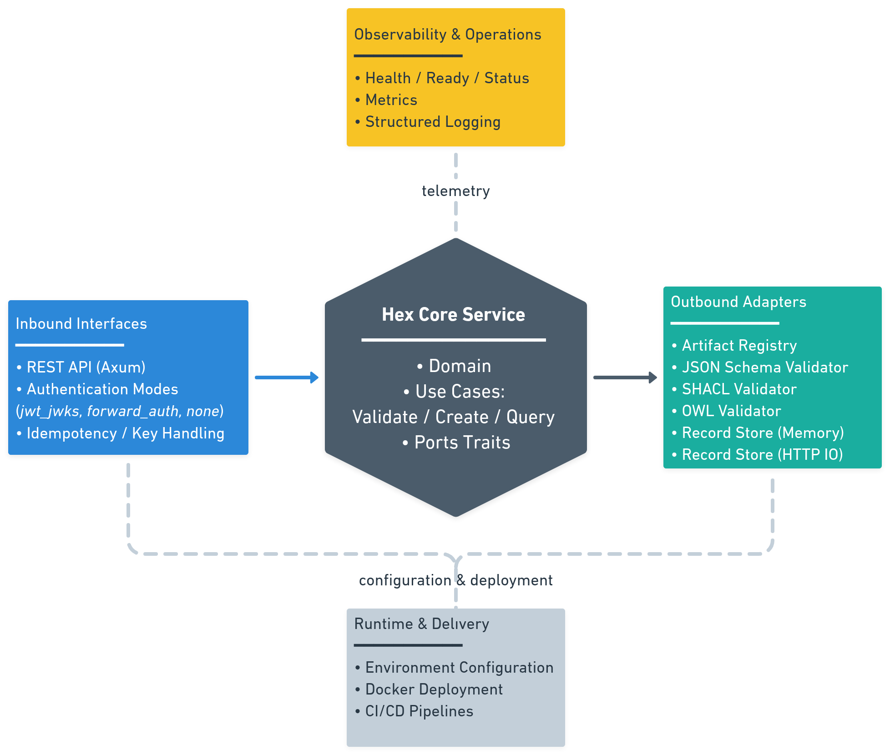

# CE-RISE Hex Core Service

[](https://doi.org/10.5281/zenodo.18952629)

A Rust-based hexagonal core service that validates and orchestrates IO for versioned, digital-passport-like records using externally published model artifacts.

This is the primary deployable microservice for CE-RISE data integrations. It exposes a model-agnostic REST API, resolves validation artifacts from a versioned catalog of model URLs, and dispatches to pluggable outbound IO adapters — all without coupling to any specific HTTP framework or repository provider.

**Documentation:** [https://ce-rise-software.codeberg.page/hex-core-service/](https://ce-rise-software.codeberg.page/hex-core-service/)

---

## What This Project Provides

- Source code for the `hex-core-service` API, validators, and adapters.
- Containerized service image for deployment.
- OpenAPI-based SDK generation pipeline with dedicated SDK repositories for Go, TypeScript, and Python.

## Architecture Figures

### Digital Passport Interaction View



Digital Passport interaction flow showing both external consumption and internal processing: clients submit/query records, the core resolves model artifacts from registry/catalog sources, validates payloads, and reads/writes through configured backend adapters.

### Deployment View



Deployment-oriented architecture view of the hex-core service, showing inbound interfaces, core orchestration, outbound adapters, and runtime dependencies in one deployable unit.

## Service Container

### Pull Image

```bash
docker pull rg.fr-par.scw.cloud/ce-rise-software/hex-core-service:<tag>
```

Use an explicit version tag (for example `v0.0.1`) for stable deployments.

### Start Container

```bash
docker run --rm -p 8080:8080 \
  -e REGISTRY_MODE=catalog \
  -e REGISTRY_CATALOG_URL="https://<catalog-host>/catalog.json" \
  -e IO_ADAPTER_ID=memory \
  -e AUTH_MODE=jwt_jwks \
  -e AUTH_JWKS_URL="https://<idp>/realms/<realm>/protocol/openid-connect/certs" \
  -e AUTH_ISSUER="https://<idp>/realms/<realm>" \
  -e AUTH_AUDIENCE="hex-core-service" \
  rg.fr-par.scw.cloud/ce-rise-software/hex-core-service:<tag>
```

### Required Runtime Parameters

| Variable | Required | Description |
|---|---|---|
| `REGISTRY_MODE` | Yes | Registry backend (`catalog`) |
| `REGISTRY_CATALOG_URL` | Yes (unless file/json alternatives are used) | URL of catalog JSON with explicit artifact references per model/version entry (`schema_url`, `shacl_url`, `owl_url`, `openapi_url`) |
| `IO_ADAPTER_ID` | Yes | IO adapter implementation (`memory` or configured HTTP adapter) |
| `AUTH_MODE` | Yes | Authentication mode (`jwt_jwks`, `forward_auth`, `none`) |
| `AUTH_JWKS_URL` | Yes for `jwt_jwks` | JWKS endpoint URL |
| `AUTH_ISSUER` | Yes for `jwt_jwks` | Expected token issuer |
| `AUTH_AUDIENCE` | Yes for `jwt_jwks` | Expected token audience |
| `AUTH_ALLOW_INSECURE_NONE` | Yes for `none` | Must be `true` to allow non-auth mode |

## SDKs

### SDK Source Repositories

- Go SDK: https://codeberg.org/CE-RISE-software/hex-core-sdk-go
- TypeScript SDK: https://codeberg.org/CE-RISE-software/hex-core-sdk-typescript
- Python SDK: https://codeberg.org/CE-RISE-software/hex-core-sdk-python

### Install SDKs

| Language | Install command |
|---|---|
| TypeScript | `npm install "@ce-rise/hex-core-sdk-typescript"` |
| Go | `go get github.com/CE-RISE-software/hex-core-sdk-go@latest` |
| Python | `pip install ce-rise-hex-core-sdk` |

Usage/import examples are maintained in each SDK repository.

## CLI

Prebuilt `hex-cli` executables are published with each tagged release on the Codeberg releases page:

- https://codeberg.org/CE-RISE-software/hex-core-service/releases

Release assets include binaries for:

- Linux
- macOS
- Windows

Each release provides platform-specific archives so you can download and run the CLI without building from source.

## License

Licensed under the [European Union Public Licence v1.2 (EUPL-1.2)](LICENSE).

---

<a href="https://europa.eu" target="_blank" rel="noopener noreferrer">
  
</a>

Funded by the European Union under Grant Agreement No. 101092281 — CE-RISE.  
Views and opinions expressed are those of the author(s) only and do not necessarily reflect those of the European Union or the granting authority (HADEA).
Neither the European Union nor the granting authority can be held responsible for them.

© 2026 CE-RISE consortium.  
Licensed under the [European Union Public Licence v1.2 (EUPL-1.2)](LICENSE).  
Attribution: CE-RISE project (Grant Agreement No. 101092281) and the individual authors/partners as indicated.

<a href="https://www.nilu.com" target="_blank" rel="noopener noreferrer">
  
</a>

Developed by NILU (Riccardo Boero — ribo@nilu.no) within the CE-RISE project.
